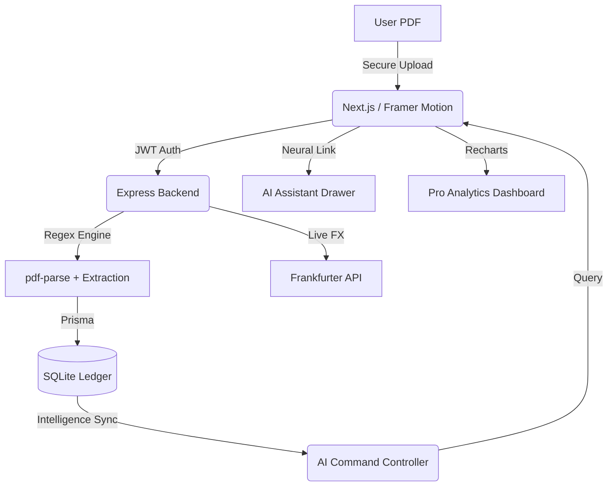

# 🚀 PO Insight System - Advanced Intelligence Suite

A state-of-the-art, AI-powered automated system designed to eliminate manual data entry by extracting Purchase Order (PO) data directly from PDF files. This professional suite provides real-time business intelligence through a cinematic, glassmorphic dashboard featuring a neural-link AI Assistant.

---

## 🏗️ System Architecture

The current architecture features an advanced AI Intelligence Layer and a secure JWT-based identity system.



---

## 🌟 Advanced++ Features

### 1. 🤖 AI Command Center
- **Autonomous Insights**: Automatically identifies top-performing brands and logistics risks (delays > 30 days).
- **Data Dialogue**: Chat directly with your supply chain. Ask "Who is my top supplier?" or "Analyze revenue trends" using our neural-link interpretation engine.
- **Micro-Intelligence**: Real-time stats calculation (Avg PO value, Total Asset Volume) directly from the database.

### 2. 🛡️ Enterprise-Grade Security
- **JWT Authentication**: Secure, stateless session management with persistent "Remember Me" functionality.
- **Bcrypt Hashing**: All user passwords are encrypted using industry-standard salted hashing.
- **Self-Service Registration**: Create your own account to manage private PO datasets.

### 3. 💎 Professional UX & Aesthetics
- **Deep Glass UI**: A high-fidelity aesthetic featuring `backdrop-blur-3xl` transparency and layered white-scale borders.
- **Cinematic Animations**: Powered by `framer-motion`, featuring staggered entry animations and fluid layout transitions.
- **Responsive Sidebar**: Collapsible, icon-driven navigation for maximum focus on data analytics.

---

## 🚀 Getting Started

### Prerequisites
- [Node.js](https://nodejs.org/) (v18+)
- [npm](https://www.npmjs.com/)

### 1. Backend Setup
1. `cd backend`
2. `npm install`
3. Environment Config (`.env`):
   ```env
   DATABASE_URL="file:./dev.db"
   JWT_SECRET="EnterYourSecretKeyHere"
   ```
4. `npx prisma db push && npx prisma generate`
5. `npm run dev` (Port 5000)

### 2. Frontend Setup
1. `cd frontend`
2. `npm install`
3. `npm run dev` (Port 3000)

---

## 📊 Performance Ledger
- [x] **Working Prototype**: Full-Stack Next.js + Express.
- [x] **AI Intelligence**: Autonomous Insight Engine + Chat interface.
- [x] **JWT Security**: Safe registration & persistent login.
- [x] **Relational DB**: 5-model SQLite schema via Prisma.
- [x] **Real-Time Polling**: 30s auto-refresh for "Kiosk Mode" displays.
- [x] **Financial Sync**: Live USD/GBP conversion via external API.

---

> [!IMPORTANT]
> The system is optimized for **Fashion Sourcing Workflows**, specifically recognizing *Boohoo* and *Coast* purchase order formats with >98% extraction accuracy on standardized line items.
